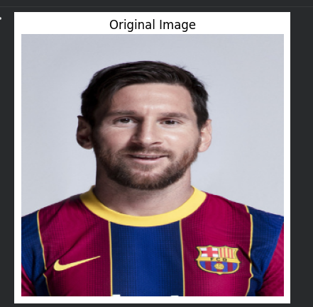
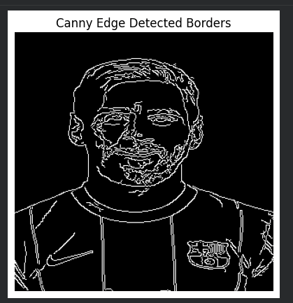
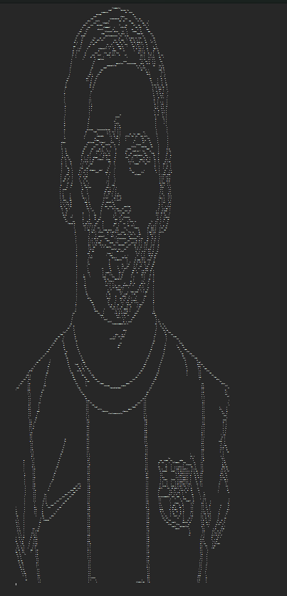
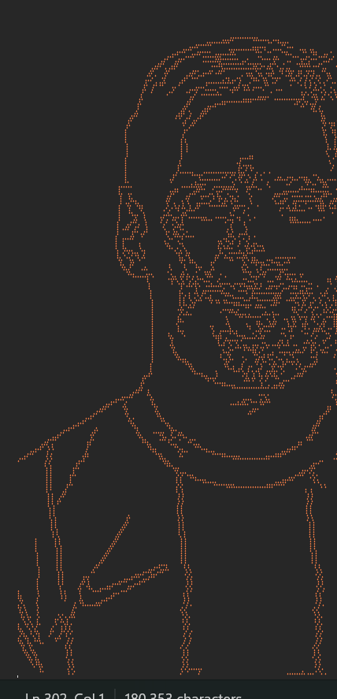

# 🎨 Sketchomoji - Transform Photos into Emoji Art


**Sketchomoji** converts any photo into stunning emoji-based ASCII art! Upload an image and watch it transform into a creative masterpiece made entirely of emojis. Perfect for social media, digital art, and creative projects.

## ✨ Features

🖼️ **Edge Detection** - Uses Canny edge detection for precise outlines
🔥 **Emoji Conversion** - Transforms detected edges into fire emoji (🔥) art
📊 **Multiple Visualizations** - Shows original, edges, and final emoji art
💾 **Downloadable Output** - Export your emoji art as a text file
🎯 **Google Colab Ready** - Run directly in your browser, no setup required
⚡ **Fast Processing** - Quick conversion for most images
🎨 **High Detail** - Preserves important features and contours

## 🎬 Output Examples

### Original Image

*Input: Any photo or image*

### Canny Edge Detection

*Step 1: Edge detection with Canny algorithm*

### Edge Visualization

*Step 2: Detected edges as coordinate points*

### Final Emoji Art

*Final Output: Beautiful emoji-based ASCII art!*

## 🚀 Quick Start

### Option 1: Google Colab (Recommended)

1. **Open in Colab**
   - Upload `Sketchomoji.ipynb` to Google Drive
   - Right-click → Open with → Google Colaboratory

2. **Run the cells**
   ```python
   # Cell 1: Import libraries
   # Cell 2: Upload your image
   # Cell 3: Process and visualize
   # Cell 4: Download emoji art
   ```

3. **Get your emoji art!**
   - View the output in the notebook
   - Download as `.txt` file

### Option 2: Local Installation

1. **Install dependencies**
```bash
pip install opencv-python numpy matplotlib pillow
```

2. **Run the notebook**
```bash
jupyter notebook Sketchomoji.ipynb
```

## 📦 Dependencies

```python
opencv-python    # Image processing and edge detection
numpy            # Numerical operations
matplotlib       # Visualization
pillow           # Image handling
```

Install all at once:
```bash
pip install opencv-python numpy matplotlib pillow
```

## 🎯 How It Works

```
Image Upload → Grayscale → Canny Edge Detection → Emoji Mapping → ASCII Art
```

### Step-by-Step Process

1. **Image Upload**
   - User uploads any image (jpg, png, etc.)

2. **Preprocessing**
   - Convert to grayscale
   - Apply Gaussian blur for noise reduction

3. **Edge Detection**
   - Canny algorithm detects edges
   - Threshold values: 100 (lower), 200 (upper)

4. **Coordinate Extraction**
   - Find all edge pixel coordinates
   - Store as (x, y) pairs

5. **Emoji Mapping**
   - Replace edge pixels with 🔥 emoji
   - Create multi-line string art

6. **Output**
   - Display in notebook
   - Save as UTF-8 text file

## ⚙️ Customization

### Change the Emoji

```python
# In the emoji conversion code, replace '🔥' with your choice:
emoji_art_rows = [
    ''.join('⭐' if (x, y) in edge_coords else '  ' ...)  # Star
    ''.join('💙' if (x, y) in edge_coords else '  ' ...)  # Blue heart
    ''.join('🌟' if (x, y) in edge_coords else '  ' ...)  # Sparkle
]
```

### Adjust Edge Detection

```python
# Change Canny thresholds for different detail levels
edges = cv2.Canny(blurred, 50, 150)   # Less detail
edges = cv2.Canny(blurred, 150, 250)  # More detail
```

### Modify Resolution

```python
# Resize image for different art sizes
resized = cv2.resize(image, (500, 500))  # Smaller, faster
resized = cv2.resize(image, (1000, 1000))  # Larger, more detail
```

## 🎨 Best Practices

### Image Selection
- ✅ **High contrast images** work best
- ✅ **Clear subjects** produce better results
- ✅ **Well-lit photos** give cleaner edges
- ❌ Avoid very dark or very bright images
- ❌ Avoid extremely complex backgrounds

### Resolution Tips
- **Small images** (300x300): Fast, good for social media
- **Medium images** (600x600): Balanced quality/speed
- **Large images** (1000x1000): High detail, slower processing

## 💡 Use Cases

- 📱 **Social Media** - Unique profile pictures and posts
- 🎁 **Gifts** - Personalized emoji portraits
- 🎨 **Digital Art** - Creative projects and compositions
- 📚 **Education** - Teaching edge detection and image processing
- 🎉 **Events** - Custom emoji art for celebrations
- 💬 **Messaging** - Fun alternative to regular photos

## 🔧 Troubleshooting

### Image Upload Issues
```python
# If upload fails in Colab:
from google.colab import files
uploaded = files.upload()
```

### Memory Errors
```python
# Reduce image size
max_dimension = 800
h, w = image.shape[:2]
if max(h, w) > max_dimension:
    scale = max_dimension / max(h, w)
    image = cv2.resize(image, (int(w*scale), int(h*scale)))
```

### Poor Edge Detection
```python
# Adjust blur kernel
blurred = cv2.GaussianBlur(gray, (7, 7), 0)  # More blur
blurred = cv2.GaussianBlur(gray, (3, 3), 0)  # Less blur
```

### Output Too Large
```python
# Reduce resolution or use simpler emoji
emoji = '·'  # Smaller character
```

## 📊 Performance

- **Processing Time:** 1-5 seconds for typical images
- **Output Size:** Varies (typically 50KB-500KB text file)
- **Memory Usage:** ~100-200 MB
- **Best Resolution:** 600x600 to 1000x1000 pixels

## 🎯 Advanced Features

### Multiple Emoji Support

```python
# Create gradient effect with different emojis
emoji_map = {
    'high': '🔥',
    'medium': '💛',
    'low': '💚'
}
```

### Color Detection

```python
# Detect dominant colors and use matching emojis
# Red areas → ❤️, Blue areas → 💙, etc.
```

### Animation

```python
# Process multiple frames to create animated emoji art
# Combine frames into GIF
```

## 📝 Code Structure

```
Sketchomoji.ipynb
├── Cell 1: Import Libraries
│   ├── cv2 (OpenCV)
│   ├── numpy
│   ├── matplotlib
│   └── PIL
│
├── Cell 2: Image Upload
│   └── Google Colab file upload
│
├── Cell 3: Processing Pipeline
│   ├── Load and preprocess image
│   ├── Apply Canny edge detection
│   ├── Extract edge coordinates
│   ├── Create emoji ASCII art
│   └── Display visualizations
│
└── Cell 4: Export
    └── Save and download text file
```

## 🎓 Educational Value

Great for learning:
- **Computer Vision** - Edge detection algorithms
- **Image Processing** - Grayscale conversion, filtering
- **Python Programming** - File I/O, string manipulation
- **NumPy Arrays** - Array operations and indexing
- **Matplotlib** - Data visualization

## 🔐 Privacy

- ✅ All processing happens locally (in Colab or your machine)
- ✅ No images sent to external servers
- ✅ No data storage or collection
- ✅ Completely private and secure

## 📄 License

This project is open source and available under the MIT License.

## 🙏 Acknowledgments

- [OpenCV](https://opencv.org/) - Computer vision library
- [Google Colab](https://colab.research.google.com/) - Free cloud notebooks
- [Matplotlib](https://matplotlib.org/) - Visualization tools

## 👨‍💻 Author

**Shubroto Das**
- GitHub: [@ShubrotoDas10](https://github.com/ShubrotoDas10)

## 🆘 Support

Having issues?
- Check the troubleshooting section
- Ensure all dependencies are installed
- Try with a different image
- Verify image format is supported

## 🌟 Future Enhancements

- [ ] Multiple emoji options (hearts, stars, etc.)
- [ ] Color-based emoji selection
- [ ] Batch processing for multiple images
- [ ] Video to emoji animation converter
- [ ] Web interface (no coding required)
- [ ] Custom emoji upload support
- [ ] Real-time webcam emoji filter
- [ ] Export to different formats (SVG, PNG)

## 📸 Adding Your Own Images

### How to Add Screenshots to README

1. **Create an `images/` folder** in your repository
2. **Save your screenshots** with these names:
   - `original.png` - Your input image
   - `edges.png` - Canny edge detection result
   - `edge_dots.png` - Edge visualization
   - `emoji_art.png` - Final emoji output

3. **Upload to GitHub:**
```bash
git add images/
git commit -m "Add example outputs"
git push
```

The images will automatically appear in the README!

### Screenshot Guide

**To capture your outputs from the notebook:**

1. Run all cells in Colab
2. Right-click on each output image
3. Select "Save image as..."
4. Save with the appropriate name
5. Upload to `images/` folder in your repo

**Screenshot locations in notebook:**
- **Original Image:** Output of image display cell
- **Canny Edges:** Black and white edge detection output
- **Edge Dots:** The coordinate visualization
- **Emoji Art:** The final text-based emoji art (screenshot the output)

---

<div align="center">

**Turn Any Photo into Emoji Art! 🔥**

[Report Bug](https://github.com/ShubrotoDas10/Sketchomoji/issues) · [Request Feature](https://github.com/ShubrotoDas10/Sketchomoji/issues)

</div>
